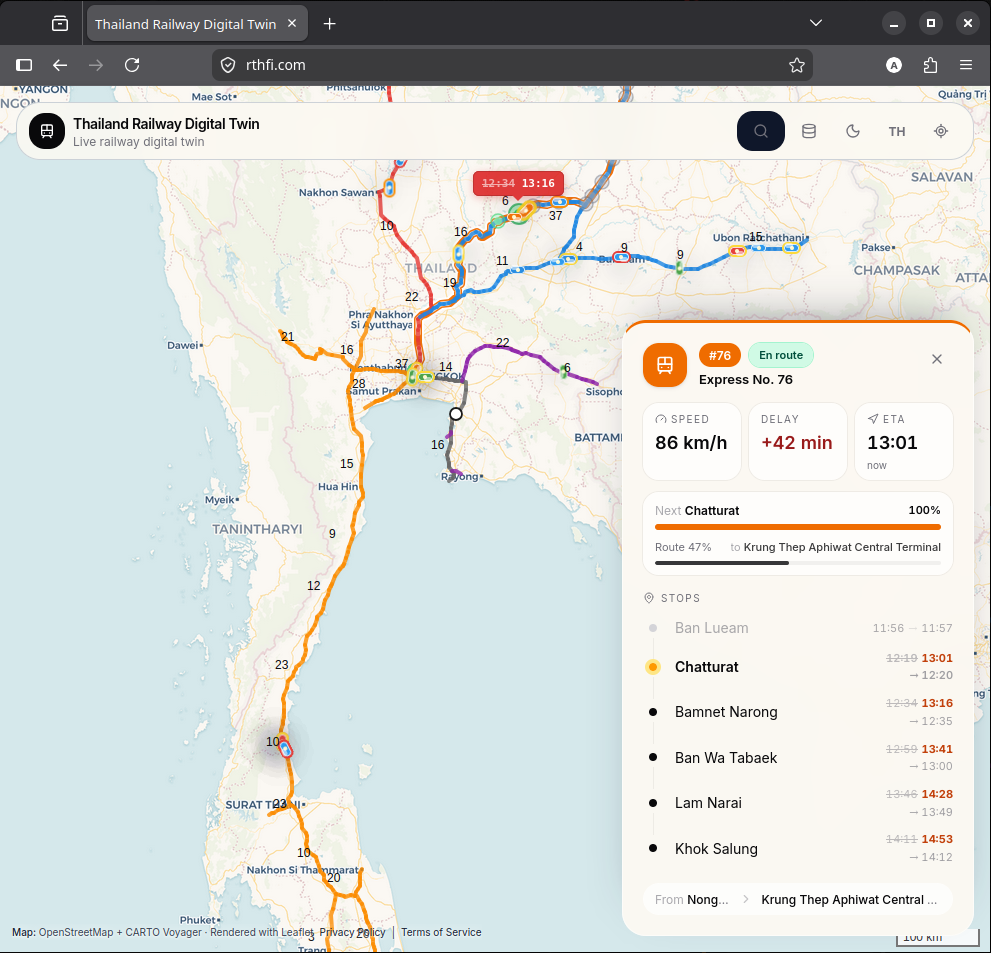

# Thailand Railway Digital Twin

[](https://github.com/andreybotkin/railtwin/actions/workflows/ci-cd.yaml)
[](https://opensource.org/licenses/MIT)

A real-time digital twin visualization of Thailand's railway network, featuring live train tracking, route information, schedule data, and support services for database setup and data ingestion.



## Features

- 🗺️ **Interactive Map**: View the complete Thai railway network with all routes and stations
- 🚂 **Real-time Train Tracking**: Watch trains move along routes according to actual schedules
- 📊 **Schedule Information**: Access departure and arrival times for all stations
- 🌓 **Dark/Light Mode**: Comfortable viewing in any lighting condition
- ⚡ **WebSocket Updates**: Live position updates without page refresh
- 📱 **Responsive Design**: Works on desktop, tablet, and mobile devices

## Tech Stack

### Simulation
- **Framework**: FastAPI (Python 3.14+)
- **Database**: PostgreSQL with PostGIS
- **ORM**: SQLAlchemy 2.0 (async)
- **Migrations**: Alembic
- **Validation**: Pydantic V2
- **Real-time**: WebSocket

### Frontend
- **Framework**: Next.js 16+ (App Router)
- **Language**: TypeScript
- **Styling**: Tailwind CSS
- **Components**: shadcn/ui
- **Maps**: Leaflet / React-Leaflet
- **State**: TanStack Query + Zustand

### Infrastructure
- **Orchestration**: K3s (Kubernetes)
- **CI/CD**: GitHub Actions
- **Containers**: Docker

## Quick Start

### Prerequisites

- Docker and Docker Compose
- Node.js 20+ (for local frontend development)
- Python 3.14+ (for local simulation development)

### Local Development with Docker

1. Clone the repository:
```bash
git clone https://github.com/andreybotkin/railtwin.git
cd railtwin
```

2. Start all services:
```bash
cp .env.example .env
docker compose up -d
```

3. Run database migrations:
```bash
docker compose exec simulation alembic upgrade head
```

4. Access the application:
   - Frontend: http://localhost:3000
   - Gateway API: http://localhost:8002
   - Simulation API: http://localhost:8000
   - Simulation API Docs: http://localhost:8000/docs

### Manual Setup

See individual README files:
- [Simulation Setup](simulation/README.md)
- [Frontend Setup](frontend/README.md)
- [Gateway Setup](gateway/README.md)
- [Rail DB Setup](raildbsetup/README.md)
- [Rail Data Collector](raildatacollector/README.md)

## Project Structure

```
railtwin/
├── frontend/               # Next.js frontend
├── gateway/                # API gateway and Redis proxy for frontend
├── simulation/             # FastAPI simulation service
├── raildbsetup/            # Database initialization and data loading service
├── raildatacollector/      # Schedule and tracking data ingestion service
├── k8s/                    # Kubernetes manifests
├── docs/                   # Project documentation
├── docker-compose.yaml     # Local development orchestration
└── .github/                # CI/CD workflows
```

## API Endpoints

| Method | Endpoint | Description |
|--------|----------|-------------|
| GET | `/api/v1/stations` | List all stations |
| GET | `/api/v1/stations/{id}` | Get station details |
| GET | `/api/v1/routes` | List all routes |
| GET | `/api/v1/routes/{id}` | Get route with geometry |
| GET | `/api/v1/trains` | List all trains |
| GET | `/api/v1/trains/positions` | Get all train positions (via gateway from Redis) |
| GET | `/api/v1/schedules` | List schedules |
| WS | `/ws/trains` | Real-time train positions |

See full API documentation at `/docs` when running the simulation service. Frontend traffic should use the gateway service. The public gateway is read-only; administrative writes must not be exposed through the internet-facing ingress.

## Precomputed Movement Plan

For high-performance trajectory generation, the simulation service supports a precomputed movement plan resolver (geops mobility-toolbox-js pattern). Rather than projecting station coordinates onto route polylines on every simulation tick, movement plans are calculated once by the `raildbsetup` service and persisted in the database. The simulation service then resolves active positions via binary search and linear interpolation.

This feature can be configured in the simulation service via the following environment variables:
- `MOVEMENT_PLAN_RUNTIME_ENABLED` (default: `false`): Set to `true` to use the precomputed plan resolver at runtime.
- `MOVEMENT_PLAN_FALLBACK_ENABLED` (default: `true`): Set to `true` to fall back to the on-the-fly trajectory generator if a precomputed plan is missing or invalid.
- `MOVEMENT_PLAN_DIAGNOSTICS_ENABLED` (default: `true`): Set to `true` to enable read-only admin endpoints for inspecting plans.

## Data Sources

- **Railway Network**: State Railway of Thailand (SRT)
- **Geographic Data**: OpenStreetMap
- **Schedules**: SRT official timetables

## Deployment

### K3s Cluster

1. Apply the namespace and network policy:
```bash
kubectl apply -f k8s/namespace.yaml
kubectl apply -f k8s/network-policy.yaml
```

2. Create local secret manifests from the tracked templates. Replace every placeholder with real values before applying them. The resulting `secrets.yaml` files are ignored by Git and must never be committed:
```bash
cp k8s/postgres/secrets.yaml.example k8s/postgres/secrets.yaml
cp k8s/raildbsetup/secrets.yaml.example k8s/raildbsetup/secrets.yaml
cp k8s/simulation/secrets.yaml.example k8s/simulation/secrets.yaml
cp k8s/raildatacollector/secrets.yaml.example k8s/raildatacollector/secrets.yaml

kubectl apply -f k8s/postgres/secrets.yaml -n railway
kubectl apply -f k8s/raildbsetup/secrets.yaml -n railway
kubectl apply -f k8s/simulation/secrets.yaml -n railway
kubectl apply -f k8s/raildatacollector/secrets.yaml -n railway
```

Use the same database username and password in `postgres-secrets` and in every service `DATABASE_URL`. Rotate credentials immediately if a real password has ever been committed to Git history.

Create `ghcr-registry-secret` as described in `k8s/ghcr-secret.yaml.example` so
K3s can pull the immutable application images from GHCR.

3. Apply the infrastructure and application manifests:
```bash
kubectl apply -k k8s
kubectl -n railway rollout status deployment/raildbsetup --timeout=20m
```

When a new image contains corrected KML, station aliases, or schedules and the
PostgreSQL PVC already exists, rebuild the persisted reference data and then
reload the simulation cache:

```bash
k8s/rebuild-reference-data.sh
kubectl -n railway rollout restart deployment/simulation
kubectl -n railway rollout status deployment/simulation --timeout=15m
```

Pushes to `main` perform this sequence automatically. The GitHub repository
must contain a base64-encoded `KUBECONFIG` Actions secret with access to the
cluster; application secrets remain pre-provisioned in the `railway` namespace.

4. Open the production ingress:
   - Frontend: https://rthfi.com
   - Gateway API: https://api.rthfi.com

See [ARCHITECTURE.md](ARCHITECTURE.md) for deployment architecture details.

## Contributing

1. Fork the repository
2. Create a feature branch (`git checkout -b feature/amazing-feature`)
3. Commit your changes (`git commit -m 'Add amazing feature'`)
4. Push the branch (`git push origin feature/amazing-feature`)
5. Open a Pull Request

### Code Style

- **Python**: Black, Ruff, mypy
- **TypeScript**: ESLint, Prettier
- **Commits**: Conventional Commits

## License

This project is licensed under the MIT License - see the [LICENSE](LICENSE) file for details.

## Acknowledgments

- State Railway of Thailand for schedule data
- OpenStreetMap contributors for geographic data
- All contributors to this project
